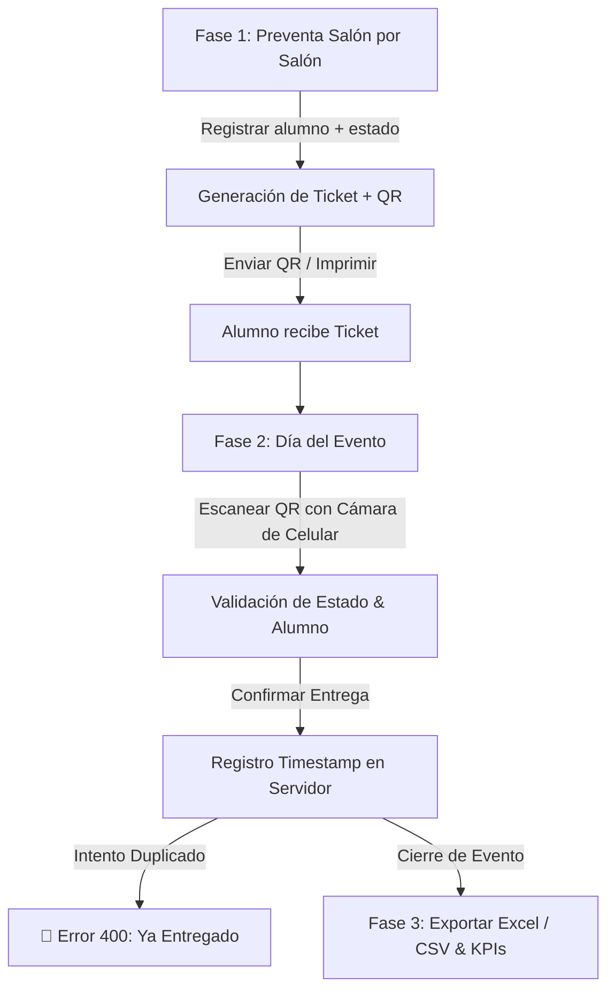

# 🎟️ Sistema de Gestión de Tickets (FastAPI + Modern Web Frontend)

Sistema de gestión, cobranza, emisión con código QR, validación con cámara de celular y exportación de reportes para eventos universitarios (ej. *"Pollada 2026"*, *"Cachimbeada 2026"*).

Designed with **FastAPI**, **SQLAlchemy**, **SQLite**, **JWT Auth**, **openpyxl**, y **Vanilla HTML/CSS/JS (Glassmorphic UI)**.

---

## 🎨 Características Principales

- **Diseño Glassmorphic Premium**: Interfaz responsive estilizada para escritorio, laptop y celular (con navegación táctil inferior en smartphones).
- **Emisión con Código QR Único**: Generación automática de código formateado (`POLL-0001-A9F2`) y código QR en imagen PNG.
- **Escáner con Cámara de Celular**: Integración de cámara web/móvil vía `html5-qrcode` para escaneo y validación en tiempo real.
- **Control Anti-Duplicados de Entrega**: Registro de fecha y hora exacta de entrega en el servidor con bloqueo de intentos duplicados.
- **KPIs & Métricas en Vivo**: Tablero interactivo con total de tickets emitidos, vendidos, separados, no vendidos y entregados.
- **Exportación en Excel y CSV**: Reportes en `.xlsx` y `.csv` descargables desde el panel.

---

## ⚡ Instalación y Ejecución Rápida

### 1. Requisitos e Instalación
Abre la consola en la carpeta del proyecto y ejecuta:
```bash
pip install -r requirements.txt
```

### 2. Inicializar Base de Datos y Semilla
Ejecuta el script para crear las tablas, el usuario administrador y los eventos iniciales:
```bash
python seed.py
```
- **Usuario por defecto**: `admin`
- **Contraseña por defecto**: `admin123`

### 3. Iniciar Servidor Accesible en Red Local
Ejecuta el script lanzador:
```bash
python run.py
```

Al iniciar, la consola mostrará un banner visual indicando las URLs de acceso:
```text
======================================================================
  🎟️   SISTEMA DE GESTIÓN DE TICKETS - SERVIDOR LOCAL Y RED   🎟️
======================================================================
  ► Acceso desde esta PC (Local):    http://localhost:8000
  ► Acceso desde Celular / Red Wi-Fi: http://192.168.1.50:8000
  ► Documentación Swagger API:        http://localhost:8000/docs
======================================================================
```

---

## 📱 Cómo Conectar tu Celular en la Misma Red Wi-Fi

1. Conecta tu celular a la **misma red Wi-Fi** a la que está conectada tu computadora.
2. Si deseas encontrar la dirección IP de tu máquina manualmente en Windows:
   - Abre la consola (CMD / PowerShell) y ejecuta `ipconfig`.
   - Busca la dirección **IPv4** de tu adaptador Wi-Fi (ejemplo: `192.168.1.50`).
3. En el navegador del celular (Chrome, Safari, Firefox), abre la URL:
   `http://192.168.1.50:8000` (reemplazando por tu IP local).

---

## 🔄 Flujo Operativo Completo de Uso



### 📋 Fase 1: Preventa Salón por Salón (Venta en Aula / Laptop)
1. El organizador ingresa a la aplicación en su laptop (`http://localhost:8000`).
2. Inicia sesión con sus credenciales y selecciona la pestaña **"Nueva Venta"**.
3. Selecciona el evento activo (ej. *"Pollada 2026"*).
4. Ingresa el nombre del alumno, código universitario y selecciona el estado:
   - **Vendido**: Alumno que canceló en el acto.
   - **Separado**: Alumno que reservó y pagará al entregar.
5. Presiona **"Generar Ticket & Código QR"**. El sistema emite inmediatamente el `codigo_unico` y muestra la imagen del QR PNG, con opción para imprimir o guardar.

### 🎪 Fase 2: Día del Evento (Validación y Entrega Físicamente con Celular)
1. Los encargados de la puerta ingresan desde sus celulares a `http://192.168.X.X:8000`.
2. Acceden a la pestaña **"Entrega & Escáner"** y presionan **"Activar Cámara / Escáner QR"**.
3. Apuntan la cámara del celular al código QR del alumno (impreso o en la pantalla de su smartphone).
4. El sistema escanea el QR, busca el ticket al instante y muestra en pantalla:
   - Nombre y código del alumno.
   - Estado de la venta (`Vendido` / `Separado`).
   - Estado de entrega (`PENDIENTE` o `ENTREGADO`).
5. **Venta Adicional en Puerta**: Si el alumno desea comprar un ticket extra en el momento, el encargado presiona **"➕ Vender Ticket Adicional"**.
6. **Confirmar Entrega**: El encargado presiona **"✅ Confirmar Entrega"**. El sistema despliega un cuadro modal de confirmación: *¿Estás seguro de que deseas confirmar la entrega del ticket POLL-0001-A9F2 a Juan Pérez?*.
7. Al hacer clic en **"Sí, Confirmar Entrega"**, el servidor marca `entregado=true` y guarda la **fecha y hora exacta** del servidor.
8. **Protección Anti-Fraude**: Si alguien intenta presentar el mismo QR por segunda vez, el sistema emite una alerta roja bloqueando el acceso e indicando la fecha y hora exacta en la que ya fue entregado previamente.

### 📊 Fase 3: Cierre y Exportación de Reportes
1. En el **Dashboard**, los organizadores observan los indicadores KPI consolidados en tiempo real.
2. Presionan el botón **"Exportar Excel"** o **"Exportar CSV"** para descargar la lista completa de todos los tickets con sus timestamps de entrega.
